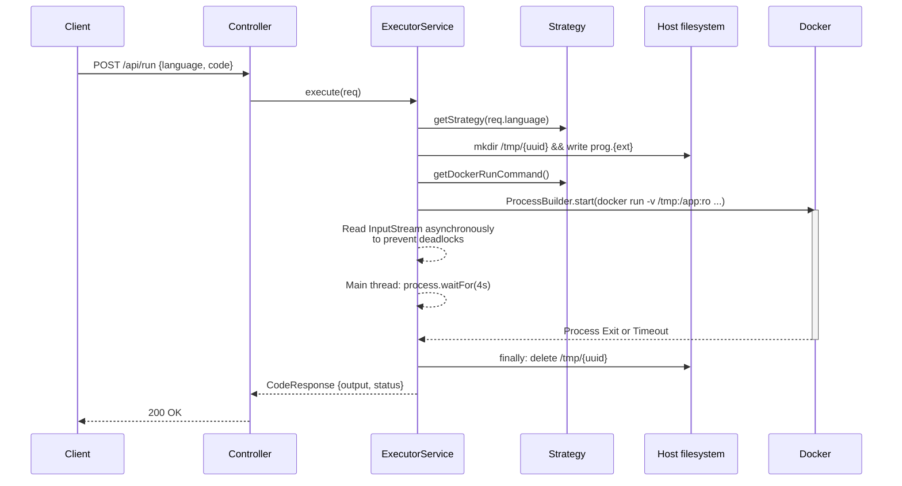
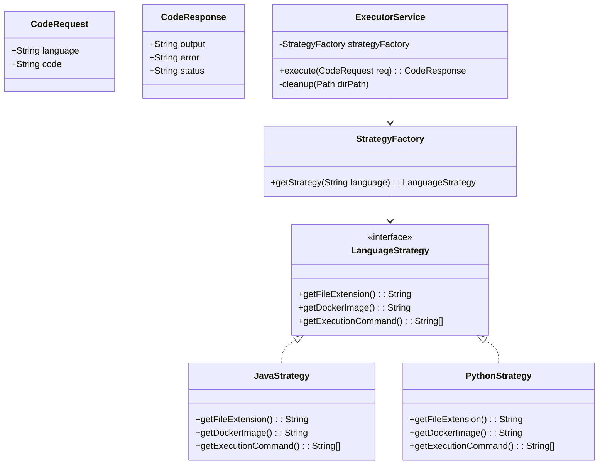

# Version 1.0 Sandbox Execution Design

This document outlines the architecture, execution flow, and class design for Version 1.0 of the Containerized Sandboxed Code Executor. It specifically addresses our discussed concerns around deadlocks, timeouts, security, and the `/tmp` graveyard.

## 1. System Architecture & Flow

The system follows a synchronous execution model for V1.0. 



## 2. SOLID Class Design (Strategy Pattern)

To ensure the system adheres to the **Open/Closed Principle (O in SOLID)**, we implement the Strategy Pattern. Adding support for a new language only requires creating a new class, with no modifications to the core `ExecutorService`.



### Component Breakdown

1.  **`LanguageStrategy` (Interface):** Defines the requirements for execution.
    *   `getFileExtension()`: e.g., `".java"`, `".py"`
    *   `getDockerImage()`: The specific docker image to use.
    *   `getExecutionCommand()`: The internal container compile/run command. Example for C++: `["bash", "-c", "g++ /app/prog.cpp -o /tmp/prog && /tmp/prog"]`.

2.  **`StrategyFactory`:** Returns the correct `LanguageStrategy` based on the requested language string. 

3.  **`ExecutorService`:** The core orchestrator.
    *   It no longer knows *how* to compile specific code.
    *   It only injects the generic `docker run --rm --network none --memory 128m -v /tmp/{uuid}:/app:ro` arguments and appends the specific `getExecutionCommand()` from the Strategy.

## 3. Resolving Core V1.0 Issues

*   **Stream Deadlocks:** When using `ProcessBuilder`, we must configure `.redirectErrorStream(true)`. We will read the resulting `InputStream` fully on a separate Thread using `.readAllBytes()` while the main thread safely sits on `waitFor(4, SECONDS)`.
*   **Timeouts:** The `waitFor(4, TimeUnit.SECONDS)` is strictly enforced. If `false` is returned, `process.destroyForcibly()` is called to nuke the container.
*   **Volume Security:** The volume mount is strictly `-v /tmp/{uuid}:/app:ro`. Since it's read-only, compilers (like `gcc`/`javac`) will be instructed to output binaries to the ephemeral container-internal `/tmp` directory instead of `/app`.
*   **Cleanup:** The execution logic is wrapped in a `try...finally` block that guarantees `/tmp/{uuid}` is recursively deleted when the endpoint finishes.

## 4. Folder Structure Context

The design adapts seamlessly into the current Spring Boot structure by introducing a `strategy` sub-package to encapsulate the language variants.

```text
src/main/java/com/example/sandboxCode/code/
├── CodeApplication.java
├── controller/
│   └── CodeExecutionController.java
├── exception/
│   ├── ServerException.java        (Current exception)
│   └── GlobalExceptionHandler.java (Optional: Maps exceptions to JSON responses)
├── model/
│   ├── CodeRequest.java
│   └── CodeResponse.java
└── service/
    ├── ExecutorService.java        (Updated to use Strategy Pattern)
    └── strategy/
        ├── LanguageStrategy.java   (Interface)
        ├── StrategyFactory.java    (Factory resolving the language)
        ├── JavaStrategy.java       (Implementation)
        └── PythonStrategy.java     (Implementation)
```

## 5. Exception Handling Strategy

In a sandboxed code execution environment, it is critical to differentiate between "Infrastructure Failures" (server fault) and "Code Execution Failures" (user fault).

1.  **Infrastructure Failures (Throw `ServerException`)**
    *   *Causes:* Fails to create `/tmp/{uuid}` directory, fails to write `prog.ext`, fails to start the `docker` process via `ProcessBuilder`, or server-side stream reading crashes.
    *   *Handling:* Throw your existing `ServerException`. This halts the execution early. The REST controller (or `@ControllerAdvice`) catches this and returns an `HTTP 500 Internal Server Error` with a message like `"Internal execution failure"`. Do not leak infrastructure details to the user.

2.  **Code Executions Failures (Return `CodeResponse`)**
    *   *Causes:* The user's code timed out (`waitFor` == false), the user's code had a compilation error, or threw a runtime exception.
    *   *Handling:* These are **not** HTTP errors; the server successfully processed the request, but the user's code failed. The API should return an `HTTP 200 OK`. The `CodeResponse` object itself encapsulates the failure.
        *   **Timeout:** When `waitFor()` returns false, force kill the container, and return `CodeResponse("Execution timed out", "", "timeout")`.
        *   **Compilation / Runtime Error:** When `exitValue != 0`, return `CodeResponse(errorLog, "", "error")`.
